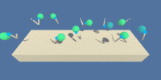

# Deep Reinforcement Learning : Continuous Control

This repository contains my implementation of the [Udacity Deep Reinforcement Learning Nanodegree]((https://www.udacity.com/course/deep-reinforcement-learning-nanodegree--nd893)) Project 2 - Continuous Control

 

## Project's Description  

For this project, you will work with the [Reacher](https://github.com/Unity-Technologies/ml-agents/blob/master/docs/Learning-Environment-Examples.md#reacher) environment.

In this environment, a double-jointed arm can move to target locations. A reward of +0.1 is provided for each step that the agent's hand is in the goal location. Thus, the goal of your agent is to maintain its position at the target location for as many time steps as possible.

The observation space consists of 33 variables corresponding to position, rotation, velocity, and angular velocities of the arm. Each action is a vector with four numbers, corresponding to torque applicable to two joints. Every entry in the action vector should be a number between -1 and 1.

### Rewards

The agent is given a reward of +0.1 for each step that the agent's hand is in the goal location

### Observation Space  

The Observation space has 33 dimensions corresponding to position, rotation, velocity, and angular velocities of the arm. 

### Actions  

Unlike the navigation project where four **discrete actions** are available, here **each action is a vector with four numbers**, corresponding to torque applicable to two joints.

### The setting and the goal

For this project, there are two separate versions of the Unity environment are available:

* The first version contains a single agent.
* The second version contains 20 identical agents, each with its own copy of the environment.

I chose the single agent Unity environment. In this case, the task is episodic, and in order to solve the environment, your agent must get an average score of +30 over 100 consecutive episodes.

 

## Getting Started

### The Environment

The environment is based on [Unity ML-agents](https://github.com/Unity-Technologies/ml-agents).

#### Step 1: Activate the Environment

1. Configure your Python environment by following [instructions in the Udacity DRLND GitHub repository](https://github.com/udacity/deep-reinforcement-learning#dependencies). These instructions can be found in the [Readme.md](https://github.com/Unity-Technologies/ml-agents/blob/master/docs/Readme.md)
1. By following the instructions you will have PyTorch, the ML-Agents toolkits, and all the Python packages required to complete the project.
1. (For Windows users) The ML-Agents toolkit supports Windows 10. It has not been tested on other versions.

#### Step 2: Download the Unity Environment 

For this project, you will **not** need to install Unity - this is because we have already built the environment for you, and you can download it from one of the links below. You need only select the environment that matches your operating system:

Version 1: One (1) Agent

* Linux: [click here](https://s3-us-west-1.amazonaws.com/udacity-drlnd/P2/Reacher/one_agent/Reacher_Linux.zip)
* Mac OSX: [click here](https://s3-us-west-1.amazonaws.com/udacity-drlnd/P2/Reacher/one_agent/Reacher.app.zip)
* Windows (32-bit): [click here](https://s3-us-west-1.amazonaws.com/udacity-drlnd/P2/Reacher/one_agent/Reacher_Windows_x86.zip)
* Windows (64-bit): [click here](https://s3-us-west-1.amazonaws.com/udacity-drlnd/P2/Reacher/one_agent/Reacher_Windows_x86_64.zip)

Version 2: Twenty (20) Agents

* Linux: [click here](https://s3-us-west-1.amazonaws.com/udacity-drlnd/P2/Reacher/Reacher_Linux.zip)
* Mac OSX: [click here](https://s3-us-west-1.amazonaws.com/udacity-drlnd/P2/Reacher/Reacher.app.zip)
* Windows (32-bit): [click here](https://s3-us-west-1.amazonaws.com/udacity-drlnd/P2/Reacher/Reacher_Windows_x86.zip)
* Windows (64-bit): [click here](https://s3-us-west-1.amazonaws.com/udacity-drlnd/P2/Reacher/Reacher_Windows_x86_64.zip)

Then, place the file in the `p2_continuous-control/` folder in the DRLND GitHub repository, and unzip (or decompress) the file.

(For Windows users) Check out [this link](https://support.microsoft.com/en-us/help/827218/how-to-determine-whether-a-computer-is-running-a-32-bit-version-or-64) if you need help with determining if your computer is running a 32-bit version or 64-bit version of the Windows operating system.

(For AWS) If you'd like to train the agent on AWS (and have not [enabled a virtual screen](https://github.com/Unity-Technologies/ml-agents/blob/master/docs/Training-on-Amazon-Web-Service.md)), then please use [this link](https://s3-us-west-1.amazonaws.com/udacity-drlnd/P2/Reacher/one_agent/Reacher_Linux_NoVis.zip) (version 1) or [this link](https://s3-us-west-1.amazonaws.com/udacity-drlnd/P2/Reacher/Reacher_Linux_NoVis.zip) (version 2) to obtain the "headless" version of the environment. You will not be able to watch the agent without enabling a virtual screen, but you will be able to train the agent. (To watch the agent, you should follow the instructions to [enable a virtual screen](https://github.com/Unity-Technologies/ml-agents/blob/master/docs/Training-on-Amazon-Web-Service.md), and then download the environment for the Linux operating system above.)

#### Step 3: Explore the Environment

After you have followed the instructions above, open `Continuous_Control.ipynb` (located in the `p2_continuous-control/` folder in the DRLND GitHub repository) and follow the instructions to learn how to use the Python API to control the agent

 

## Train a agent

Execute the provided notebook: `Continuous_Control-a_single_agent.ipynb`

1. `model.py` implements the Deep Deterministic Polich Gradient (DDPG) Actor and Critic networks. This currently contains fully-connected neural network with ReLU activation. You can change the structure of the neural network and play with it.
   > Deep Deterministic Policy Gradient (DDPG) is a model-free off-policy algorithm for learning continous actions. It combines ideas from DPG (Deterministic Policy Gradient) and DQN (Deep Q-Network). It uses Experience Replay and slow-learning target networks from DQN, and it is based on DPG, which can operate over continuous action spaces. [source](https://keras.io/examples/rl/ddpg_pendulum/)

2. `ddpg_agent.py` implementss the Agent, OUNoise, and ReplayBuffer. The Agent has Actor network and Critic network. Actor network proposes an action given an state and Critic network predicts if the action is good or bad given a state and an action. Each Actor and Critic network has local and target network. For continuous action spaces, exploration is done via adding noise to the action and the authors of the paper, [Lillicrap, Timothy P., et al. "Continuous control with deep reinforcement learning." arXiv preprint arXiv:1509.02971 (2015).,](https://arxiv.org/pdf/1509.02971.pdf), used Ornstein-Uhlenbeck process.
   > An advantage of off-policies algorithms such as DDPG is that we can treat the problem of exploration independently from the learning algorithm. We constructed an exploration policy μ′ by adding noise sampled from a noise process N to our actor policy. As detailed in the supplementary materials we used an Ornstein-Uhlenbeck process (Uhlenbeck & Ornstein, 1930) to generate temporally correlated exploration for exploration efficiency in physical control problems with inertia. [Source](https://arxiv.org/pdf/1509.02971.pdf)

    The Agent also uses Experience Replay.  
   > Reinforcement learning algorithms use replay buffers to store trajectories of experience when executing a policy in an environment. During training, replay buffers are queried for a subset of the trajectories (either a sequential subset or a sample) to "replay" the agent's experience. [Source](https://www.tensorflow.org/agents/tutorials/5_replay_buffers_tutorial)

3. `checkpoint_actor.pth` and `checkpoint_critic.pth` are the saved models.
