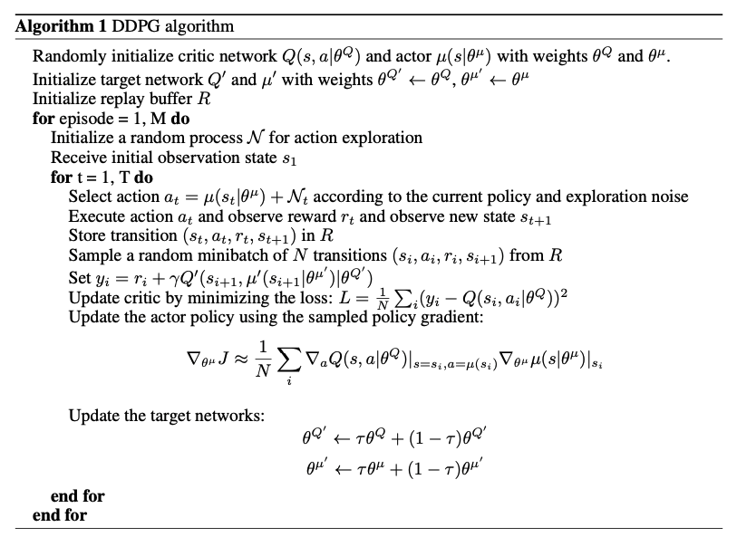
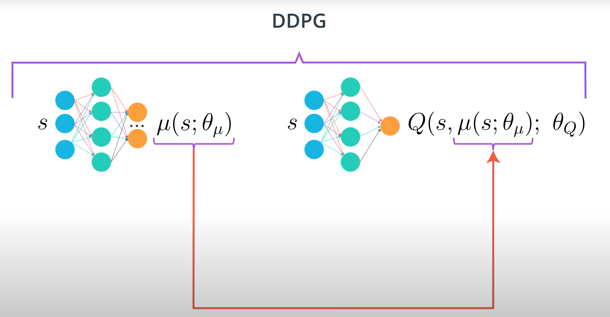
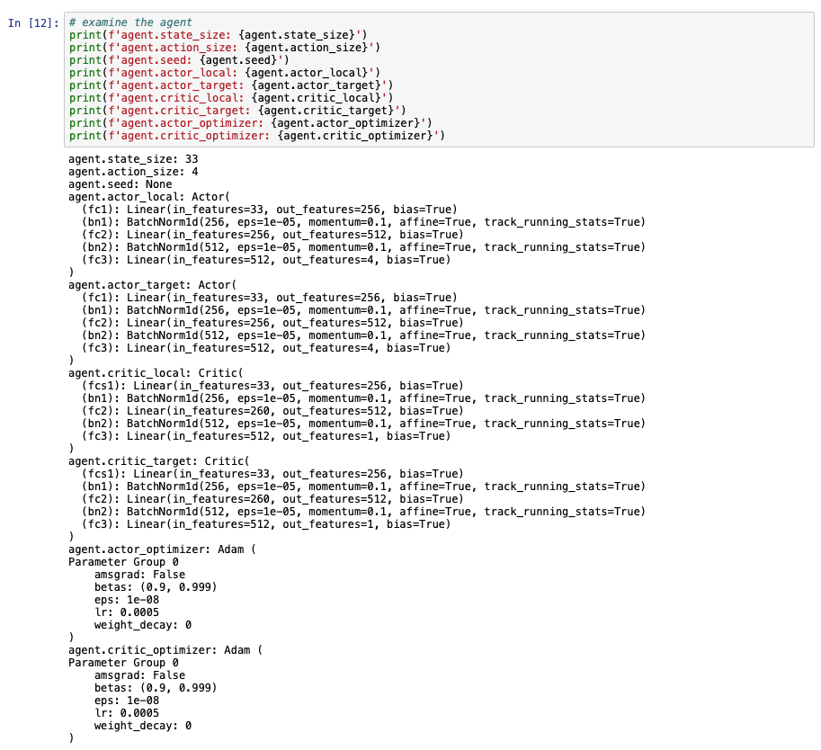
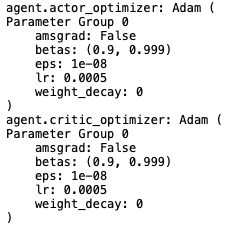
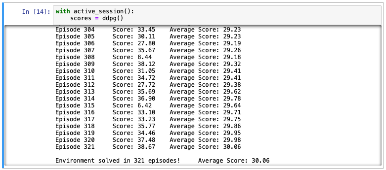
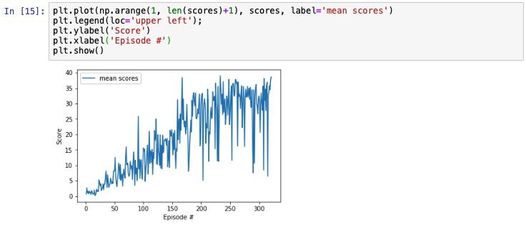
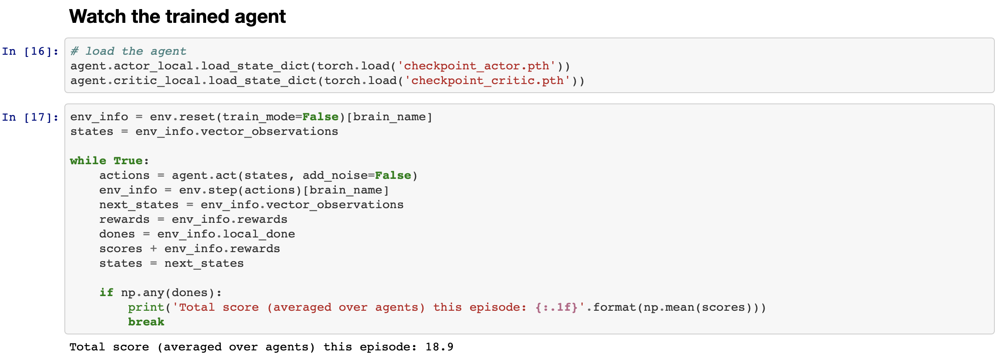

# Deep Reinforcement Learning : Continuous Control

This report contains my implementation of the [Udacity Deep Reinforcement Learning Nanodegree]((https://www.udacity.com/course/deep-reinforcement-learning-nanodegree--nd893)) Project 2 - Continuous Control

## Project's Goal  

For this project, I worked with the [Reacher](https://github.com/Unity-Technologies/ml-agents/blob/master/docs/Learning-Environment-Examples.md#reacher) environment.

In this environment, a double-jointed arm can move to target locations. A reward of +0.1 is provided for each step that the agent's hand is in the goal location. Thus, the goal of your agent is to maintain its position at the target location for as many time steps as possible.

The observation space consists of 33 variables corresponding to position, rotation, velocity, and angular velocities of the arm. Each action is a vector with four numbers, corresponding to torque applicable to two joints. Every entry in the action vector should be a number between -1 and 1.

For this project, there are two separate versions of the Unity environment are available:

* The first version contains a single agent.
* The second version contains 20 identical agents, each with its own copy of the environment.

I chose the single agent Unity environment. In this case, the task is episodic, and in order to solve the environment, your agent must get an average score of +30 over 100 consecutive episodes.

### Rewards

The agent is given a reward of +0.1 for each step that the agent's hand is in the goal location

### Observation Space  

The Observation space has 33 dimensions corresponding to position, rotation, velocity, and angular velocities of the arm. 

### Actions  

Unlike the navigation project where four **discrete actions** are available, here **each action is a vector with four numbers**, corresponding to torque applicable to two joints.

<br>

## Deep Deterministic Polich Gradient (DDPG)

This project implements Deep Deterministic Polich Gradient (DDPG) Actor-Critic method. DDPG is a model-free, off-policy reinforcement learning that combines [Deterministic Policy Gradient (DPG)](https://hal.inria.fr/file/index/docid/938992/filename/dpg-icml2014.pdf) with [Deep Q-Network (DQN)](https://storage.googleapis.com/deepmind-media/dqn/DQNNaturePaper.pdf). As mentioned in [my previous project](https://github.com/DoosanJung/Udacity-deep-reinforcement-learning-nanodegree-navigation/blob/main/Report.md#deep-q-networks), DQN stabilizes the learning of Q-function by experience replay and the fixed target network. The original DQN works in discrete space, and DDPG extends it to continuous space with the actor-critic framework while learning a deterministic policy.

For more information, please refer to the paper, [Lillicrap, Timothy P., et al. "Continuous control with deep reinforcement learning." arXiv preprint arXiv:1509.02971 (2015).,](https://arxiv.org/pdf/1509.02971.pdf).

> Deep Deterministic Policy Gradient (DDPG) is a model-free off-policy algorithm for learning continous actions. It combines ideas from DPG (Deterministic Policy Gradient) and DQN (Deep Q-Network). It uses Experience Replay and slow-learning target networks from DQN, and it is based on DPG, which can operate over continuous action spaces. [source](https://keras.io/examples/rl/ddpg_pendulum/)

> Our contribution here is to provide modifications to DPG, inspired by the success of DQN, which allow it to use neural network function approximators to learn in large state and action spaces online. We refer to our algorithm as Deep DPG (DDPG, Algorithm 1).[source](https://arxiv.org/pdf/1509.02971.pdf)

In the paper mentioned above, they described the algorithm in detail and showed the pseudocode as in below:




<br>

## Algorithm and Implementation



This screenshot is taken from the [Deep Reinforcement Learning Nanodegree course](https://www.udacity.com/course/deep-reinforcement-learning-nanodegree--nd893)


### Code Implementation

The implementation is borrowed from the 'DDPG' coding exercise from the 'Actor-Critic Methods' lesson in the Udacitiy [Deep Reinforcement Learning Nanodegree](https://www.udacity.com/course/deep-reinforcement-learning-nanodegree--nd893) program.

1. `model.py` implements the Deep Deterministic Polich Gradient (DDPG) Actor and Critic networks. This currently contains fully-connected neural network with ReLU activation. You can change the structure of the neural network and play with it.
   > Deep Deterministic Policy Gradient (DDPG) is a model-free off-policy algorithm for learning continous actions. It combines ideas from DPG (Deterministic Policy Gradient) and DQN (Deep Q-Network). It uses Experience Replay and slow-learning target networks from DQN, and it is based on DPG, which can operate over continuous action spaces. [source](https://keras.io/examples/rl/ddpg_pendulum/)
   
   The Actor and Critic Local and Target networks are defined as below:
   

   Similarly to [the paper](https://arxiv.org/pdf/1509.02971.pdf), I also included [Batch normalization](http://proceedings.mlr.press/v37/ioffe15.pdf)

2. `ddpg_agent.py` implementss the Agent, OUNoise, and ReplayBuffer. The Agent has Actor network and Critic network. Actor network proposes an action given an state and Critic network predicts if the action is good or bad given a state and an action.Each Actor and Critic network has local and target network. For continuous action spaces, exploration is done via adding noise to the action and the authors of the paper, [Lillicrap, Timothy P., et al. "Continuous control with deep reinforcement learning." arXiv preprint arXiv:1509.02971 (2015).,](https://arxiv.org/pdf/1509.02971.pdf), used Ornstein-Uhlenbeck process.
   > An advantage of off- policies algorithms such as DDPG is that we can treat the problem of exploration independently from the learning algorithm. We constructed an exploration policy μ′ by adding noise sampled from a noise process N to our actor policy. As detailed in the supplementary materials we used an Ornstein-Uhlenbeck process (Uhlenbeck & Ornstein, 1930) to generate temporally correlated exploration for exploration efficiency in physical control problems with inertia. [Source](https://arxiv.org/pdf/1509.02971.pdf)

    The Agent also uses Experience Replay.  
   > Reinforcement learning algorithms use replay buffers to store trajectories of experience when executing a policy in an environment. During training, replay buffers are queried for a subset of the trajectories (either a sequential subset or a sample) to "replay" the agent's experience. [Source](https://www.tensorflow.org/agents/tutorials/5_replay_buffers_tutorial)

3. `checkpoint_actor.pth` and `checkpoint_critic.pth` are the saved models. The file extention, `.pth`, is a common PyTorch convention to save models
4. `Continuous_Control-a_single_agent.ipynb`. Here we actually train the agent. The parameters used in the training is in below.

  
### DDPG Actor-Critic Parameters

The DDPG Actor Critic uses the following parameters values.

```Python
# model parameters
class Actor(nn.Module):
    """Actor (Policy) Model."""
    def __init__(self, state_size, action_size, seed, fc1_units=256, fc2_units=512):
        (...)

class Critic(nn.Module):
    """Critic (Value) Model."""
    def __init__(self, state_size, action_size, seed, fcs1_units=256, fc2_units=512):
        (...)

# agent parameters
BUFFER_SIZE = int(1e6)  # replay buffer size
BATCH_SIZE = 128        # minibatch size
GAMMA = 0.99            # discount factor
TAU = 1e-3              # for soft update of target parameters
LR_ACTOR = 5e-4         # learning rate of the actor
LR_CRITIC = 5e-4        # learning rate of the critic
WEIGHT_DECAY = 0        # L2 weight decay
EPSILON_DECAY = 1e-6    # epsilon decay
EPSILON = 1.0           # exploration actions space
LEARN_INTERVAL = 20     # learning 10 times per 20 timesteps   
LEARN_TIMES = 10    

# training parameters
n_episodes = 1000       # maximum number of training episodes
max_t = 1000            # maximum number of timesteps per episode
```

The Neural Networks use the Adam optimizer as shown below:  


### The Result

Given the chosen architecture and parameters, the result looks like below:

#### Training log



#### Scores


As you can see from the training log and the scores plot, the environment was solved in 321 episodes. Sometimes the agent failed to get a high enough score. E.g., 6.42 in Episode 315 and 8.44 in Episode 308. But overall, the most recent scores are generally higher than 30.0.

#### Watch the trained agent's performace



As you can see from the screenshot, I loaded the saved model and tried to see if this trained agent would do good or bad. Unfortunately, the agent does not seem to achieve the required score, instead it only received 18.9.

### Ideas for Future Work

I tried the multi-agents Unity environment first, hoping that I can solve this version. But, I wasn't able to solve this environment so I changed it to the first Unity environment (a single agent). Even for the single agent version, I struggeld to find a good model architecture and good hyperparameters such as learning rates, gamma, L2 weight decay and so on. After numerous experiments, mine are different than the one proposed in the [paper](https://arxiv.org/pdf/1509.02971.pdf). 

All of my experiments suffered from an unstable agent. I do not think that my agent performed well in all of my experiments and it definitely needs some dramatic changes. Beside DDPG and my choice of network architectures and hyperparameters, there are many options out there to try, including  Trust Region Policy Optimization (TRPO) and Truncated Natural Policy Gradient (TNPG) as mentioned in the Udacity project description as well as [Proximal Policy Optimization (PPO)](https://openai.com/blog/openai-baselines-ppo/) and [Distributed Distributional Deterministic Policy Gradients (D4PG)](https://openreview.net/forum?id=SyZipzbCb). 